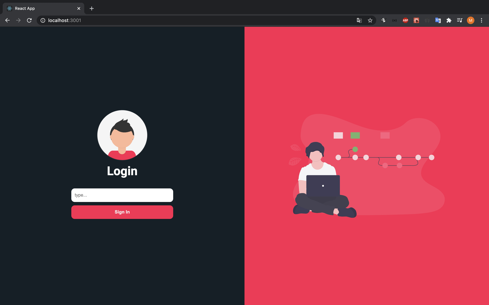

<h1 align="center">
    Github Profile with React
</h1>

<p align="center">
   
</p>

<p align="center">
    <a href="https://react-hook-form-profile-github.vercel.app/" > DEMO </a>
</p>

## :rocket: Technologies

- [ReactJS](https://reactjs.org/)
- [Typescript][ts]
- [react-router-dom](https://github.com/ReactTraining/react-router)
- [styled-components](https://www.styled-components.com/)
- [react-hook-form](https://react-hook-form.com/)
- [storybook](https://storybook.js.org/)
- [yup](https://www.npmjs.com/package/yup?activeTab=readme)
- [VS Code][vscode] with [EditorConfig][vceditconfig] and [ESLint][vceslint]

## Getting Started

First, run the development server:

```bash
yarn install or npm install

cd react-hook-form-profile-github

npm run dev
# or
yarn dev
```

Open [http://localhost:3000](http://localhost:3000) with your browser to see the result.

You can start editing the page by modifying `src/App.tsx`. The page auto-updates as you edit the file.

## Commands

- `dev`: runs your application on `localhost:3000`
- `build`: creates the production build version
- `start`: starts a simple server with the build production code
- `storybook`: runs storybook on `localhost:6006`
- `build-storybook`: create the build version of storybook


Made with ♥ by Matheus Martins :wave: [Get in touch!](https://www.linkedin.com/in/matheus-martins-78859b117/)

[ts]: https://www.typescriptlang.org
[vscode]: https://code.visualstudio.com/
[yarn]: https://yarnpkg.com/
[vceditconfig]: https://marketplace.visualstudio.com/items?itemName=EditorConfig.EditorConfig
[vceslint]: https://marketplace.visualstudio.com/items?itemName=dbaeumer.vscode-eslint
